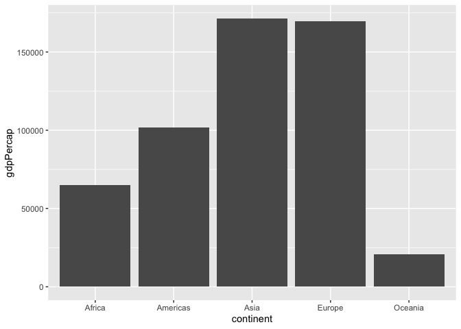
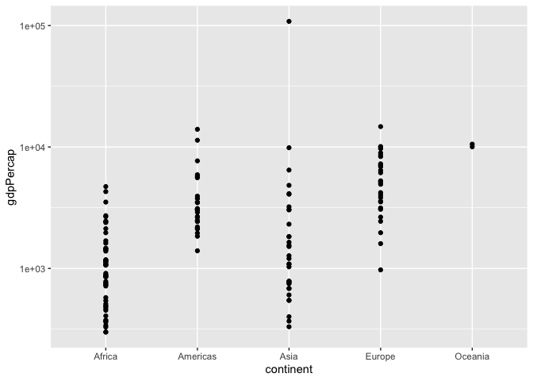
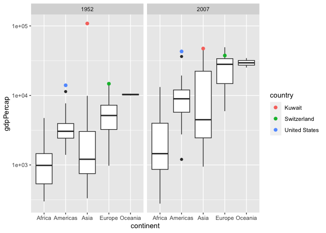
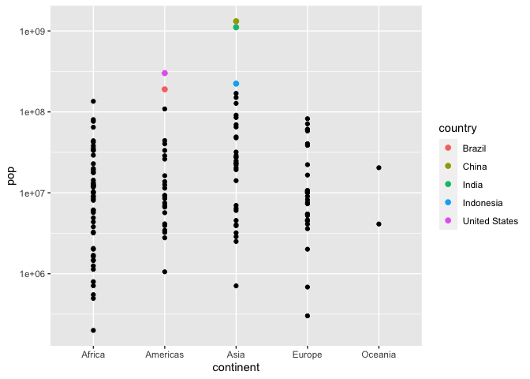
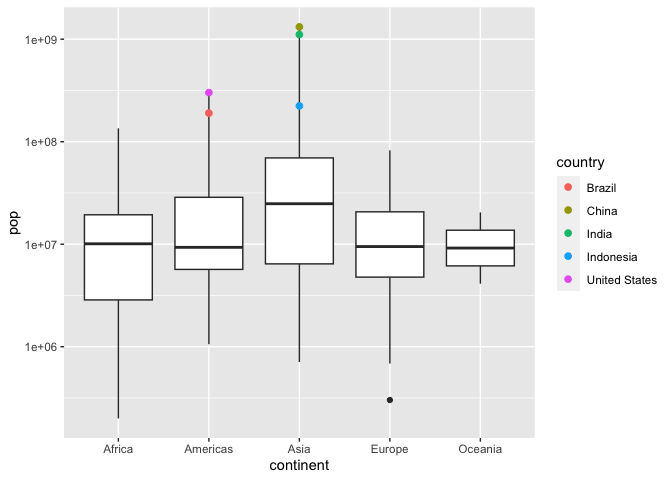
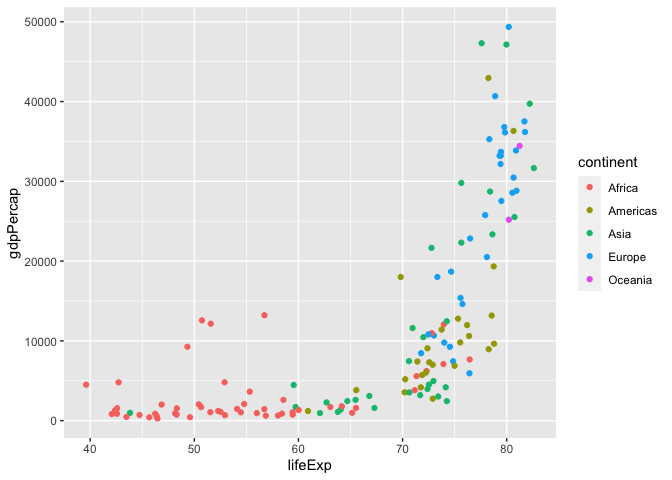
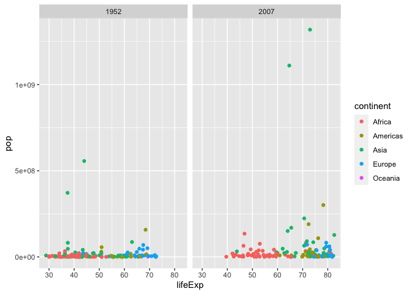

Gapminder
================
Satchel
2020-

- <a href="#grading-rubric" id="toc-grading-rubric">Grading Rubric</a>
  - <a href="#individual" id="toc-individual">Individual</a>
  - <a href="#due-date" id="toc-due-date">Due Date</a>
- <a href="#guided-eda" id="toc-guided-eda">Guided EDA</a>
  - <a
    href="#q0-perform-your-first-checks-on-the-dataset-what-variables-are-in-this"
    id="toc-q0-perform-your-first-checks-on-the-dataset-what-variables-are-in-this"><strong>q0</strong>
    Perform your “first checks” on the dataset. What variables are in
    this</a>
  - <a
    href="#q1-determine-the-most-and-least-recent-years-in-the-gapminder-dataset"
    id="toc-q1-determine-the-most-and-least-recent-years-in-the-gapminder-dataset"><strong>q1</strong>
    Determine the most and least recent years in the <code>gapminder</code>
    dataset.</a>
  - <a
    href="#q2-filter-on-years-matching-year_min-and-make-a-plot-of-the-gdp-per-capita-against-continent-choose-an-appropriate-geom_-to-visualize-the-data-what-observations-can-you-make"
    id="toc-q2-filter-on-years-matching-year_min-and-make-a-plot-of-the-gdp-per-capita-against-continent-choose-an-appropriate-geom_-to-visualize-the-data-what-observations-can-you-make"><strong>q2</strong>
    Filter on years matching <code>year_min</code>, and make a plot of the
    GDP per capita against continent. Choose an appropriate
    <code>geom_</code> to visualize the data. What observations can you
    make?</a>
  - <a
    href="#q3-you-should-have-found-at-least-three-outliers-in-q2-but-possibly-many-more-identify-those-outliers-figure-out-which-countries-they-are"
    id="toc-q3-you-should-have-found-at-least-three-outliers-in-q2-but-possibly-many-more-identify-those-outliers-figure-out-which-countries-they-are"><strong>q3</strong>
    You should have found <em>at least</em> three outliers in q2 (but
    possibly many more!). Identify those outliers (figure out which
    countries they are).</a>
  - <a
    href="#q4-create-a-plot-similar-to-yours-from-q2-studying-both-year_min-and-year_max-find-a-way-to-highlight-the-outliers-from-q3-on-your-plot-in-a-way-that-lets-you-identify-which-country-is-which-compare-the-patterns-between-year_min-and-year_max"
    id="toc-q4-create-a-plot-similar-to-yours-from-q2-studying-both-year_min-and-year_max-find-a-way-to-highlight-the-outliers-from-q3-on-your-plot-in-a-way-that-lets-you-identify-which-country-is-which-compare-the-patterns-between-year_min-and-year_max"><strong>q4</strong>
    Create a plot similar to yours from q2 studying both
    <code>year_min</code> and <code>year_max</code>. Find a way to highlight
    the outliers from q3 on your plot <em>in a way that lets you identify
    which country is which</em>. Compare the patterns between
    <code>year_min</code> and <code>year_max</code>.</a>
- <a href="#your-own-eda" id="toc-your-own-eda">Your Own EDA</a>
  - <a
    href="#q5-create-at-least-three-new-figures-below-with-each-figure-try-to-pose-new-questions-about-the-data"
    id="toc-q5-create-at-least-three-new-figures-below-with-each-figure-try-to-pose-new-questions-about-the-data"><strong>q5</strong>
    Create <em>at least</em> three new figures below. With each figure, try
    to pose new questions about the data.</a>

*Purpose*: Learning to do EDA well takes practice! In this challenge
you’ll further practice EDA by first completing a guided exploration,
then by conducting your own investigation. This challenge will also give
you a chance to use the wide variety of visual tools we’ve been
learning.

<!-- include-rubric -->

# Grading Rubric

<!-- -------------------------------------------------- -->

Unlike exercises, **challenges will be graded**. The following rubrics
define how you will be graded, both on an individual and team basis.

## Individual

<!-- ------------------------- -->

| Category    | Needs Improvement                                                                                                | Satisfactory                                                                                                               |
|-------------|------------------------------------------------------------------------------------------------------------------|----------------------------------------------------------------------------------------------------------------------------|
| Effort      | Some task **q**’s left unattempted                                                                               | All task **q**’s attempted                                                                                                 |
| Observed    | Did not document observations, or observations incorrect                                                         | Documented correct observations based on analysis                                                                          |
| Supported   | Some observations not clearly supported by analysis                                                              | All observations clearly supported by analysis (table, graph, etc.)                                                        |
| Assessed    | Observations include claims not supported by the data, or reflect a level of certainty not warranted by the data | Observations are appropriately qualified by the quality & relevance of the data and (in)conclusiveness of the support      |
| Specified   | Uses the phrase “more data are necessary” without clarification                                                  | Any statement that “more data are necessary” specifies which *specific* data are needed to answer what *specific* question |
| Code Styled | Violations of the [style guide](https://style.tidyverse.org/) hinder readability                                 | Code sufficiently close to the [style guide](https://style.tidyverse.org/)                                                 |

## Due Date

<!-- ------------------------- -->

All the deliverables stated in the rubrics above are due **at midnight**
before the day of the class discussion of the challenge. See the
[Syllabus](https://docs.google.com/document/d/1qeP6DUS8Djq_A0HMllMqsSqX3a9dbcx1/edit?usp=sharing&ouid=110386251748498665069&rtpof=true&sd=true)
for more information.

``` r
library(tidyverse)
```

    ## ── Attaching packages ─────────────────────────────────────── tidyverse 1.3.2 ──
    ## ✔ ggplot2 3.4.0      ✔ purrr   1.0.1 
    ## ✔ tibble  3.1.8      ✔ dplyr   1.0.10
    ## ✔ tidyr   1.2.1      ✔ stringr 1.5.0 
    ## ✔ readr   2.1.3      ✔ forcats 0.5.2 
    ## ── Conflicts ────────────────────────────────────────── tidyverse_conflicts() ──
    ## ✖ dplyr::filter() masks stats::filter()
    ## ✖ dplyr::lag()    masks stats::lag()

``` r
library(gapminder)
```

*Background*: [Gapminder](https://www.gapminder.org/about-gapminder/) is
an independent organization that seeks to educate people about the state
of the world. They seek to counteract the worldview constructed by a
hype-driven media cycle, and promote a “fact-based worldview” by
focusing on data. The dataset we’ll study in this challenge is from
Gapminder.

# Guided EDA

<!-- -------------------------------------------------- -->

First, we’ll go through a round of *guided EDA*. Try to pay attention to
the high-level process we’re going through—after this guided round
you’ll be responsible for doing another cycle of EDA on your own!

### **q0** Perform your “first checks” on the dataset. What variables are in this

dataset?

``` r
## TASK: Do your "first checks" here!
glimpse(gapminder)
```

    ## Rows: 1,704
    ## Columns: 6
    ## $ country   <fct> "Afghanistan", "Afghanistan", "Afghanistan", "Afghanistan", …
    ## $ continent <fct> Asia, Asia, Asia, Asia, Asia, Asia, Asia, Asia, Asia, Asia, …
    ## $ year      <int> 1952, 1957, 1962, 1967, 1972, 1977, 1982, 1987, 1992, 1997, …
    ## $ lifeExp   <dbl> 28.801, 30.332, 31.997, 34.020, 36.088, 38.438, 39.854, 40.8…
    ## $ pop       <int> 8425333, 9240934, 10267083, 11537966, 13079460, 14880372, 12…
    ## $ gdpPercap <dbl> 779.4453, 820.8530, 853.1007, 836.1971, 739.9811, 786.1134, …

``` r
gapminder
```

    ## # A tibble: 1,704 × 6
    ##    country     continent  year lifeExp      pop gdpPercap
    ##    <fct>       <fct>     <int>   <dbl>    <int>     <dbl>
    ##  1 Afghanistan Asia       1952    28.8  8425333      779.
    ##  2 Afghanistan Asia       1957    30.3  9240934      821.
    ##  3 Afghanistan Asia       1962    32.0 10267083      853.
    ##  4 Afghanistan Asia       1967    34.0 11537966      836.
    ##  5 Afghanistan Asia       1972    36.1 13079460      740.
    ##  6 Afghanistan Asia       1977    38.4 14880372      786.
    ##  7 Afghanistan Asia       1982    39.9 12881816      978.
    ##  8 Afghanistan Asia       1987    40.8 13867957      852.
    ##  9 Afghanistan Asia       1992    41.7 16317921      649.
    ## 10 Afghanistan Asia       1997    41.8 22227415      635.
    ## # … with 1,694 more rows

``` r
?gapminder
```

**Observations**:

- Write all variable names here
- country
- continent
- year
- lifeExp
- pop
- gdpPercap

### **q1** Determine the most and least recent years in the `gapminder` dataset.

*Hint*: Use the `pull()` function to get a vector out of a tibble.
(Rather than the `$` notation of base R.)

``` r
## TASK: Find the largest and smallest values of `year` in `gapminder`
year_max <- max(pull(gapminder, year))
year_min <- min(pull(gapminder, year))
```

Use the following test to check your work.

``` r
## NOTE: No need to change this
assertthat::assert_that(year_max %% 7 == 5)
```

    ## [1] TRUE

``` r
assertthat::assert_that(year_max %% 3 == 0)
```

    ## [1] TRUE

``` r
assertthat::assert_that(year_min %% 7 == 6)
```

    ## [1] TRUE

``` r
assertthat::assert_that(year_min %% 3 == 2)
```

    ## [1] TRUE

``` r
if (is_tibble(year_max)) {
  print("year_max is a tibble; try using `pull()` to get a vector")
  assertthat::assert_that(False)
}

print("Nice!")
```

    ## [1] "Nice!"

### **q2** Filter on years matching `year_min`, and make a plot of the GDP per capita against continent. Choose an appropriate `geom_` to visualize the data. What observations can you make?

You may encounter difficulties in visualizing these data; if so document
your challenges and attempt to produce the most informative visual you
can.

``` r
## TASK: Create a visual of gdpPercap vs continent

q2.0 <- gapminder %>% 
  filter(year == year_min) %>% 
  ggplot(aes(x = continent, y = gdpPercap)) +
  geom_col()
q2.0
```

<!-- -->

``` r
q2.1 <- gapminder %>% 
  filter(year == year_min) %>% 
  ggplot(aes(x = continent, y = gdpPercap)) +
  geom_point() +
  scale_y_log10()
q2.1
```

<!-- -->

``` r
q2.2 <- gapminder %>% 
  filter(year == year_min) %>% 
  ggplot(aes(continent, gdpPercap)) +
  scale_y_log10() +
  geom_boxplot()
q2.2
```

<!-- -->

``` r
year_min
```

    ## [1] 1952

**Observations**:

- Write your observations here

- Plot 0

  - In 1952, the Asian continent had the largest GDP per capita.

  - The continent with the next largest GDP per capita was Europe,
    followed by the Americas, Africa and then Oceania.

  - There seems to be one country that takes up a large portion of the
    Asian continent.

  - There seems to be a few other countries that take up significant
    amount of gdp within their continent.

- Plot 1

  - the Oceania continents countries were very concentrated.

  - One country in the Asian continent was much higher than the rest.

  - One country in europe and two in the americas also stuck out above
    the rest of the countries in their respective continents.

- Plot 2

  - When I used the boxplot I was able to see again one country in Asia
    much higher then the rest.

  - The two countries in the americas were still visibly positioned
    above the rest of the countries in their continent

  - The country in europe that was positioned above the rest of the
    countries in Plot 1 was not visible anymore.

**Difficulties & Approaches**:

- Write your challenges and your approach to solving them
- filtering out the year - looked up how to filter it
- how to properly represent data - drew out some visuals first then
  tried to work towards those visuals
- Writing it all out at once - I coded it step by step and checked that
  I got something I expected at each spot
- Showing the different countries in the data - decided to use methods
  where the individual countries didn’t matter as much
- Showing outliers - used boxplots to show the medians of the countries
  which allowed the outliers to stick out more.

### **q3** You should have found *at least* three outliers in q2 (but possibly many more!). Identify those outliers (figure out which countries they are).

``` r
## TASK: Identify the outliers from q2
top_3 <- gapminder %>% 
  filter(year == year_min) %>% 
  arrange(desc(gdpPercap)) %>% 
  head(10)

top_3
```

    ## # A tibble: 10 × 6
    ##    country        continent  year lifeExp       pop gdpPercap
    ##    <fct>          <fct>     <int>   <dbl>     <int>     <dbl>
    ##  1 Kuwait         Asia       1952    55.6    160000   108382.
    ##  2 Switzerland    Europe     1952    69.6   4815000    14734.
    ##  3 United States  Americas   1952    68.4 157553000    13990.
    ##  4 Canada         Americas   1952    68.8  14785584    11367.
    ##  5 New Zealand    Oceania    1952    69.4   1994794    10557.
    ##  6 Norway         Europe     1952    72.7   3327728    10095.
    ##  7 Australia      Oceania    1952    69.1   8691212    10040.
    ##  8 United Kingdom Europe     1952    69.2  50430000     9980.
    ##  9 Bahrain        Asia       1952    50.9    120447     9867.
    ## 10 Denmark        Europe     1952    70.8   4334000     9692.

**Observations**:

- Identify the outlier countries from q2
  - Kuwait was the largest outlier with a gdp per capita of 108382.353
  - The next outlier was Switzerland, which had a significantly smaller
    gdp per capita then Kuwait
  - Switzerland was closely followed by the United States
  - The next country was Canada, which wasn’t as close as to the US, as
    the US was with Switzerland
  - The rest of the countries were relatively close to one another in
    their gdp per capita

*Hint*: For the next task, it’s helpful to know a ggplot trick we’ll
learn in an upcoming exercise: You can use the `data` argument inside
any `geom_*` to modify the data that will be plotted *by that geom
only*. For instance, you can use this trick to filter a set of points to
label:

``` r
## NOTE: No need to edit, use ideas from this in q4 below
gapminder %>%
  filter(year == max(year)) %>%

  ggplot(aes(continent, lifeExp)) +
  geom_boxplot() +
  geom_point(
    data = . %>% filter(country %in% c("United Kingdom", "Japan", "Zambia")),
    mapping = aes(color = country),
    size = 2
  )
```

<!-- -->

### **q4** Create a plot similar to yours from q2 studying both `year_min` and `year_max`. Find a way to highlight the outliers from q3 on your plot *in a way that lets you identify which country is which*. Compare the patterns between `year_min` and `year_max`.

*Hint*: We’ve learned a lot of different ways to show multiple
variables; think about using different aesthetics or facets.

``` r
## TASK: Create a visual of gdpPercap vs continent
q4 <- gapminder %>% 
  filter(year == year_min | year == year_max) %>% 
  ggplot(aes(continent, gdpPercap)) +
  scale_y_log10() +
  geom_boxplot() +  geom_point(
    data = . %>% filter(country %in% c("Kuwait", "Switzerland", "United States")),
    mapping = aes(color = country),
    size = 2
  ) +
  facet_wrap(~ year)
q4
```

<!-- -->

**Observations**:

- Kuwait’s gdp per capita went down significantly
- United States and Switzerlands gdp per capita went up
- It appears Kuwait still has the largest gdp per capita

# Your Own EDA

<!-- -------------------------------------------------- -->

Now it’s your turn! We just went through guided EDA considering the GDP
per capita at two time points. You can continue looking at outliers,
consider different years, repeat the exercise with `lifeExp`, consider
the relationship between variables, or something else entirely.

### **q5** Create *at least* three new figures below. With each figure, try to pose new questions about the data.

``` r
## TASK: Your first graph
top_5_pop <- gapminder %>% 
  filter(year == year_max) %>% 
  arrange(desc(pop)) %>% 
  head(5)
top_5_pop
```

    ## # A tibble: 5 × 6
    ##   country       continent  year lifeExp        pop gdpPercap
    ##   <fct>         <fct>     <int>   <dbl>      <int>     <dbl>
    ## 1 China         Asia       2007    73.0 1318683096     4959.
    ## 2 India         Asia       2007    64.7 1110396331     2452.
    ## 3 United States Americas   2007    78.2  301139947    42952.
    ## 4 Indonesia     Asia       2007    70.6  223547000     3541.
    ## 5 Brazil        Americas   2007    72.4  190010647     9066.

``` r
q5.1 <- gapminder %>% 
  filter(year == year_max) %>% 
  ggplot(aes(x = continent, y = pop)) +
  geom_point() +
  geom_point(
    data = . %>% filter(country %in% c("China", "India", "United States", "Indonesia", "Brazil")),
    mapping = aes(color = country),
    size = 2
  ) +
  scale_y_log10()
q5.1
```

<!-- -->

``` r
q5.2 <- gapminder %>% 
  filter(year == year_max) %>% 
  ggplot(aes(x = continent, y = pop)) +
  geom_boxplot() +
  geom_point(
    data = . %>% filter(country %in% c("China", "India", "United States", "Indonesia", "Brazil")),
    mapping = aes(color = country),
    size = 2
  ) +
  scale_y_log10()
q5.2
```

<!-- -->

- Observations
  - India and China clearly had the largest populations

  - Countries in the asian continent have the highest average population

  - The African American European and Oceanian countries have similar
    average populations
- Questions
  - Does number of countries in continent effect population

  - Is gdp tied to population

  - does continent with largest country median population correlate with
    continent with country with largest population

  - What year is this plot for

``` r
## TASK: Your second graph
q6.1 <- gapminder %>% 
  filter(year == year_max) %>% 
  ggplot(aes(lifeExp, gdpPercap)) +
  geom_point(mapping = aes(color = continent))
q6.1
```

<!-- -->

- Observations
  - A larger gdp per capita relates to a longer life expectancy

  - Many of the countries from the same continent are loosely grouped
    together
- Questions
  - Why do some countries with longer life expectancy have lower gdp per
    capitas

  - which continents the least amount of correlation between its
    countries - which continent has the most spread between its
    countries

``` r
## TASK: Your third graph

q7.1 <- gapminder  %>% 
  filter(year == year_max | year == year_min) %>% 
  ggplot(aes(lifeExp, pop)) +
  geom_point(mapping = aes(color = continent)) +
  facet_wrap(~ year)
q7.1
```

<!-- -->

- (Your notes and observations here)
- Observations
  - The low end of the life expectancy went from 30 years to 40 years

  - The upper end of the life expectancy went from approximately 70
    years to 80 years

  - It doesn’t seem there is a strong enough correlation between
    population level and life expectancy between continents.
- Questions
  - Does population get affected by life expectancy

  - What effects do different birth rates have to allow for countries
    with lower life expectancy to have similar populations with
    countries that have a high life expectancy
